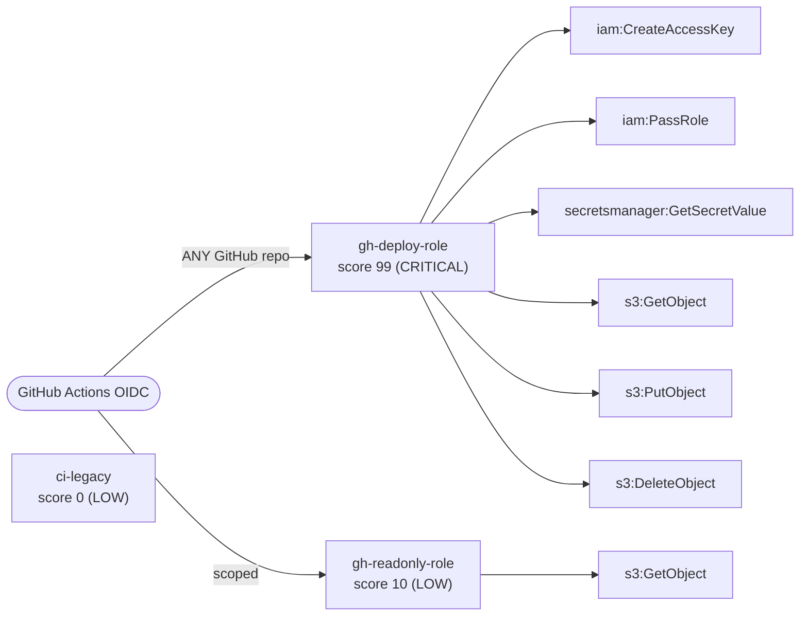

```mermaid
flowchart LR
  gh(["GitHub Actions OIDC"])
  r0["gh-deploy-role<br/>score 99 (CRITICAL)"]
  gh -->|"ANY GitHub repo"| r0
  r0 --> r0a0["iam:CreateAccessKey"]
  r0 --> r0a1["iam:PassRole"]
  r0 --> r0a2["secretsmanager:GetSecretValue"]
  r0 --> r0a3["s3:GetObject"]
  r0 --> r0a4["s3:PutObject"]
  r0 --> r0a5["s3:DeleteObject"]
  r1["gh-readonly-role<br/>score 10 (LOW)"]
  gh -->|"scoped"| r1
  r1 --> r1a0["s3:GetObject"]
  r2["ci-legacy<br/>score 0 (LOW)"]
```
